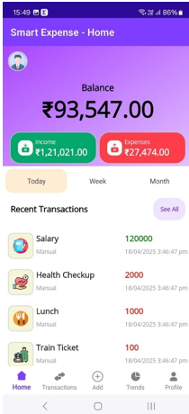
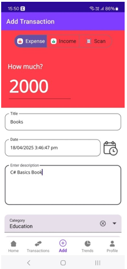
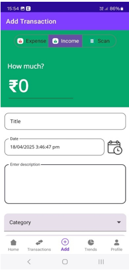
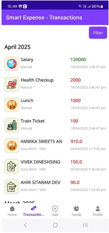
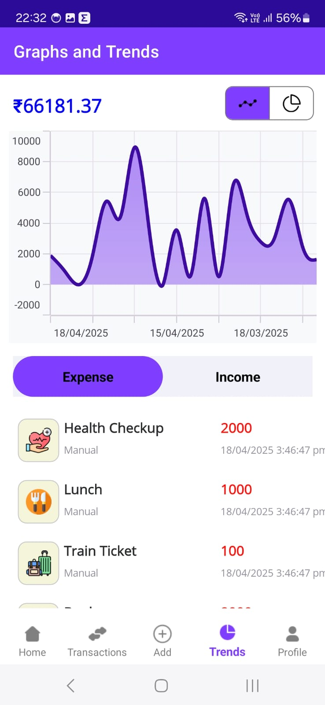
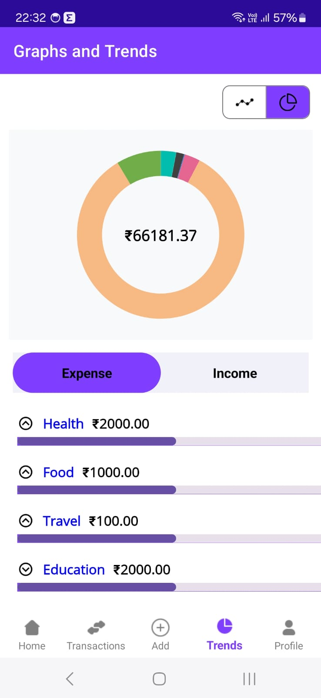

# SmartExpenseApp
A cross-platform expense tracking application built using **.NET MAUI** that helps users efficiently manage daily expenses. The application automatically extracts transaction details from SMS messages, categorizes expenses into predefined categories, and provides insightful dashboards to track spending habits.

## 🚀 Features

- 📱 Cross-platform mobile application built with .NET MAUI
- 📩 Automatic transaction extraction using SMS parsing
- 🏷️ Rule-based expense categorization (Food, Health, Shopping, Travel, etc.)
- 📊 Interactive graphs and spending trends
- 💾 Local data storage using SQLite
- 📈 Expense history and analytics

## 🛠️ Tech Stack

- **Language:** C#
- **Framework:** .NET MAUI
- **Database:** SQLite
- **IDE:** Visual Studio 2022
- **Version Control:** Git & GitHub

---

## 📸 Screenshots

### 🏠 Home Screen

<p align="center">
  
</p>

---

### ➕ Add Expense

<p align="center">
  
</p>

---

### 💰 Add Income

<p align="center">
  
</p>

---

### 📋 Transactions

<p align="center">
  
</p>

---

### 📈 Graphs & Trends

<p align="center">
  
  
</p>

---

## ⚙️ Installation

Clone the repository

```bash
git clone https://github.com/DhruvalRakeshGohil2006/SmartExpenseApp.git
```

Open the solution in **Visual Studio 2022**.

Restore all NuGet packages and run the application on an Android emulator or a physical Android device.

---

## 🔮 Future Enhancements

- OCR-based receipt scanning
- Budget planning and alerts
- Cloud synchronization
- Export reports to PDF/Excel
- AI-powered expense insights

---

## 📬 Contact

**Dhruval Rakesh Gohil**

- LinkedIn: https://www.linkedin.com/in/dhruval-rakesh-gohil
- GitHub: https://github.com/DhruvalRakeshGohil2006

⭐ If you found this project useful, consider giving it a star!
